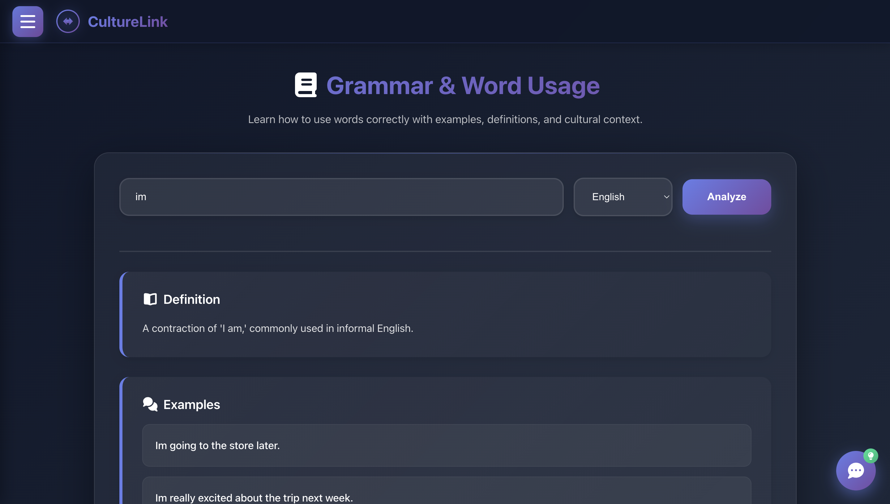
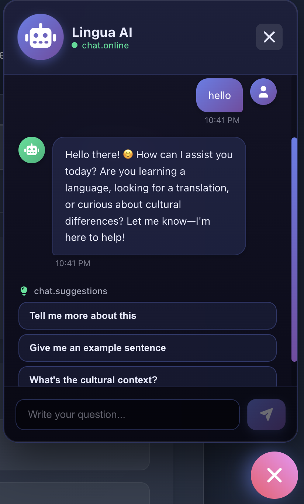
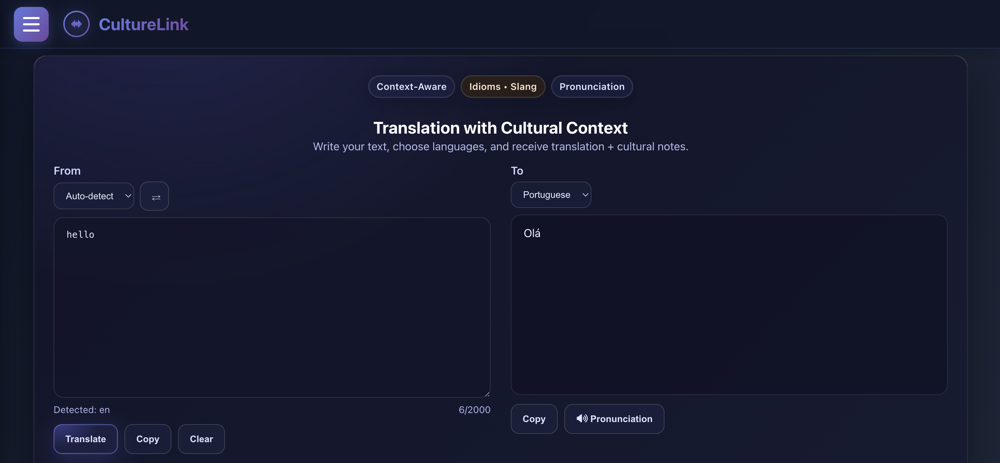
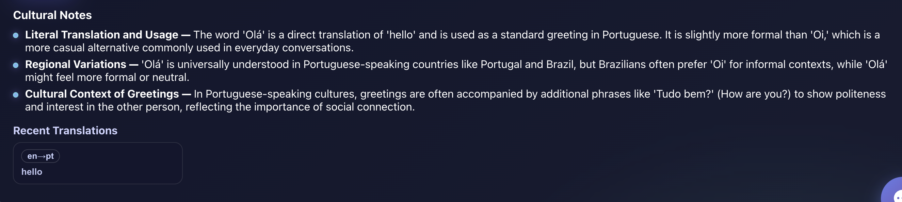

# Translator with Cultural Context 🌍

A modern translation application that goes beyond simple word-for-word translation by providing cultural context, grammar insights, and interactive learning features.

## 📸 Screenshots

### Home Page


### Translation Interface


### Grammar Analysis


### Cultural Context


### Features Overview


## ✨ Features

- **Smart Translation**: Translate text between multiple languages with cultural context
- **Grammar Analysis**: Deep dive into word meanings, pronunciation, and usage
- **Cultural Context**: Understand cultural nuances and expressions
- **Interactive Learning**: Practice and learn with real examples
- **Multi-language Support**: Support for English, Portuguese, Spanish, French, German, and Arabic
- **Modern UI**: Clean, responsive interface with smooth animations

## 🛠️ Tech Stack

### Frontend
- React.js
- i18next for internationalization
- Font Awesome icons
- CSS3 with animations

### Backend
- Python Flask
- SQLite database
- RESTful API

## 🚀 Getting Started

### Prerequisites
- Node.js and npm
- Python 3.x
- Docker (optional)

### Installation

1. Clone the repository:
```bash
git clone <repository-url>
cd "Translator with Cultural Context"
```

2. Install frontend dependencies:
```bash
npm install
```

3. Install backend dependencies:
```bash
cd backend
pip install -r requirements.txt
```

### Running the Application

#### Option 1: Manual Setup

1. Start the backend:
```bash
cd backend
python app.py
```

2. Start the frontend (in a new terminal):
```bash
npm start
```

The application will be available at `http://localhost:3000`

#### Option 2: Docker

```bash
docker-compose up
```

## 📁 Project Structure

```
├── src/                    # Frontend source code
│   ├── components/        # React components
│   ├── pages/            # Page components
│   ├── i18n/             # Internationalization config
│   └── styles/           # CSS styles
├── backend/               # Backend API
│   ├── app.py            # Flask application
│   ├── requirements.txt  # Python dependencies
│   └── translations.db   # SQLite database
├── public/               # Static assets
└── ReadmeImg/            # Screenshots

```

## 🌐 Supported Languages

- 🇬🇧 English
- 🇵🇹 Portuguese
- 🇪🇸 Spanish
- 🇫🇷 French
- 🇩🇪 German
- 🇸🇦 Arabic

## 📝 License

This project is open source and available under the MIT License.

## 🤝 Contributing

Contributions, issues, and feature requests are welcome!

---

Made with ❤️ by MedRobotsMac
